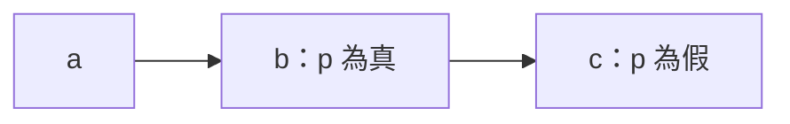

# 少一條邊，公理 4 就失效

在 Kripke 框架中，箭頭表示 [可達關係]^^(Accessibility)。

```mermaid
flowchart LR
  a["a"] --> b["b：p 為真"]
  b --> c["c：p 為假"]
```

少了 $a\to c$ 時，從 $a$ 一步只到 $b$，
兩步卻能到 $c$。因此一步可達的世界都滿足 $p$，
兩步可達的世界就未必。

試著加上 `a --> c`。$a$ 一步就能到 $c$，
原來的反例便失效。
